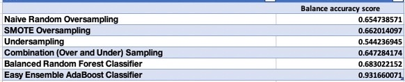
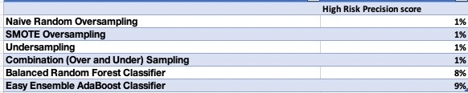
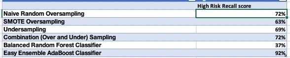
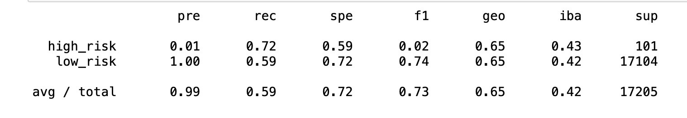
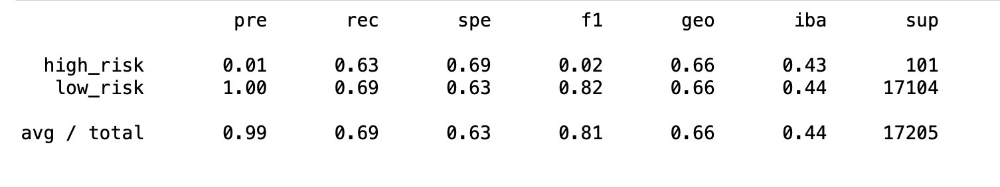
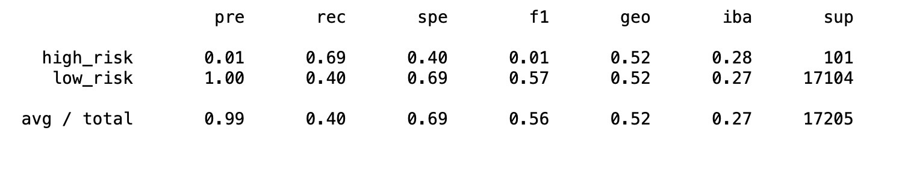
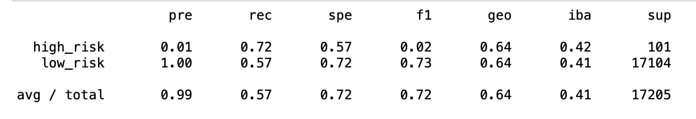
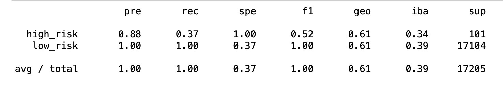
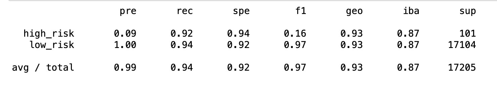

# Credit_Risk_Analysis

## Overview of the analysis: 

The purpuse of this analysis is to apply different techniques to train and evaluate models with unbalanced classes. After the performance evaluation we need to make a recommendation on wheather they should be used to predict credit risk.

## Results: 

## Summary: 

### Naive Random Oversampling

### SMOTE Oversampling

### Undersampling

### Combination (Over and Under) Sampling

### Balanced Random Forest Classifier

### Easy Ensemble AdaBoost Classifier

The best performance was for the Easy Ensemble AdaBoost Classifier and I would recommend to use it.